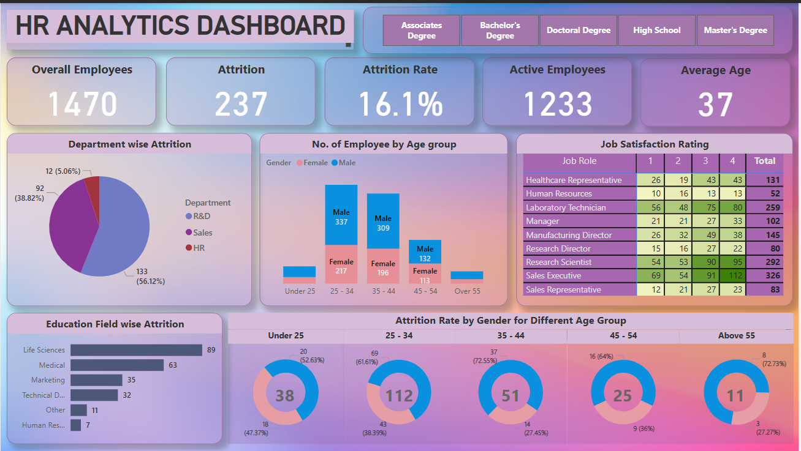

# HR Analytics Dashboard

## Overview
An interactive Power BI dashboard that provides comprehensive analytics and visualizations for HR metrics, including employee attrition, satisfaction ratings, and demographic breakdowns. The dashboard offers insights into workforce trends and key HR indicators.

## Features

- **Employee Overview**
  - Total Employees: 1,470
  - Attrition: 237
  - Attrition Rate: 16.1%
  - Active Employees: 1,233
  - Average Age: 37

- **Department-wise Analysis**
  - Attrition breakdown for R&D, Sales, and HR departments
  - Visual representation via pie charts

- **Demographics**
  - Employee count categorized by age group and gender
  - Education field-wise attrition breakdown

- **Job Satisfaction Ratings**
  - Ratings for various job roles such as Healthcare Representative, Manager, Research Scientist, etc.
  - Color-coded satisfaction matrix for easy analysis

- **Attrition Trends**
  - Attrition rate by gender for different age groups
  - Interactive donut charts showing percentage breakdowns

## Key Insights

- **Attrition Trends**
  - R&D department has the highest attrition (56.12%)
  - Most employees leaving are from Life Sciences and Medical fields

- **Satisfaction Analysis**
  - Research Scientists and Laboratory Technicians show higher satisfaction ratings
  - Sales Executives have notable dissatisfaction levels

- **Age & Gender Breakdown**
  - Employees aged 25-44 form the largest workforce segment
  - Male employees outnumber female employees in most age groups

## Technical Details

- Built using Microsoft Power BI
- Interactive visuals including pie charts, bar graphs, and matrix tables
- Dynamic filtering for deeper insights
- Color-coded heatmaps for job satisfaction ratings

## How to Use

1. Download the Power BI file.
2. Open in Microsoft Power BI Desktop.
3. Use filters and slicers to explore specific metrics.
4. Hover over visuals for detailed insights.

## Prerequisites

- Microsoft Power BI Desktop
- Data source (if applicable) should be refreshed for updated analysis

## Installation

1. Clone the repository.
2. Open the .pbix file in Power BI.
3. Explore the dashboard interactively.

## Contributing

Feel free to fork this project and submit pull requests for any enhancements.

## Contact

If you have any questions, feedback, or suggestions, please don't hesitate to reach out:

- **LinkedIn**: [Connect with me on LinkedIn](https://www.linkedin.com/in/iajithks/)

Happy analyzing!
